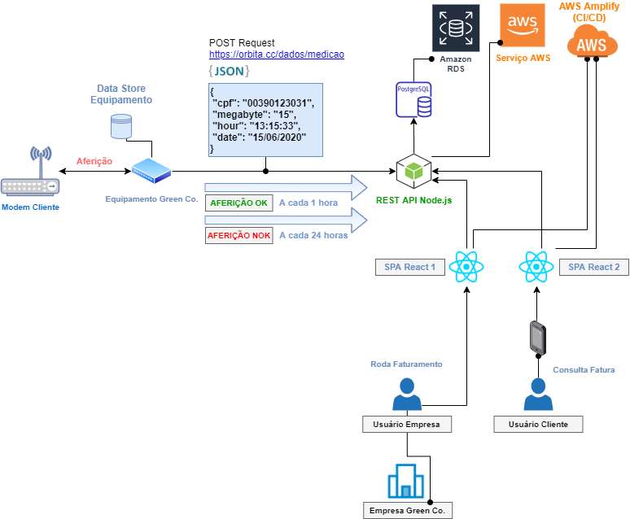

  

# Projeto
<strong>Medidor de Consumo - Web App</strong>

Esse projeto tem por objetivo apresentar uma aplicação Web que receberá o consumo de dados em megabyte, referente a um determinado período (backend) e permitirá ao usuário consultar o seu consumo por uma Aplicação Web (frontend).

 

# Tecnologias
Foram utilizadas as seguintes tecnologias:

- [Node.js](https://nodejs.org/en)
- [React](https://reactjs.org)

 

# Backend
Fluxograma do projeto:

  

 

# Frontend
Snapshots:

 
  
  
  

 

# Vídeos

- [Medidor de Consumo - Web App (Fluxograma do Projeto)](https://youtu.be/lR0X3cR9dAk)
- [Medidor de Consumo - Web App (Backend) - Parte 1](https://youtu.be/yT_jV0aznuc)
- [Medidor de Consumo - Web App (Backend) - Parte 2](https://youtu.be/7e_3LmQipsA)
- [Medidor de Consumo - Web App (Frontend)](https://youtu.be/nTU33jcWwQI)
- [Medidor de Consumo - Web App (Demo)](https://youtu.be/ysfJrAA-LAE)

 

# JSON

- [JSON Insomnia](https://drive.google.com/file/d/1SbEBN-l4cCAO_aIBTcXHR5uhyAIwczFW/view?usp=sharing)
