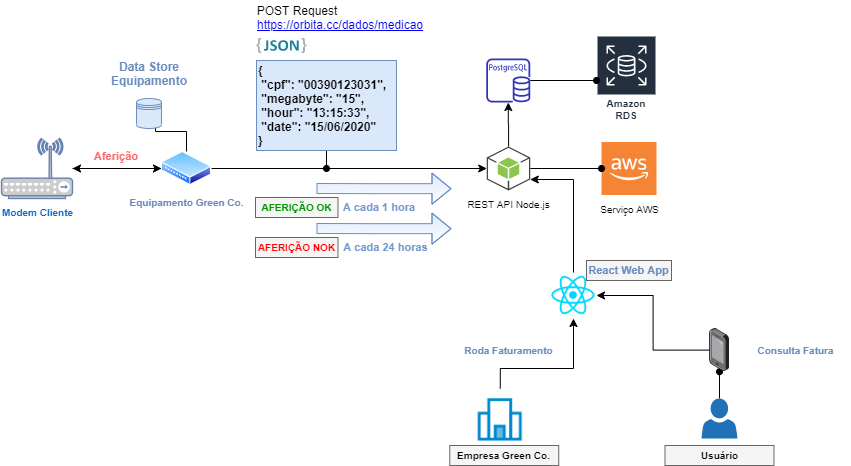

  <!--
  -->

# Projeto
<strong>Consumption Meter Web App - Backend</strong>

Esse projeto tem por objetivo construir uma aplicação Web que receberá o consumo de dados em megabyte, referente a um determinado período (backend) e permitirá ao usuário consultar o seu consumo por uma Aplicação Web (frontend).

 
<!--

  
  

  
  

-->

# Fluxograma
Fluxograma do projeto:

  

